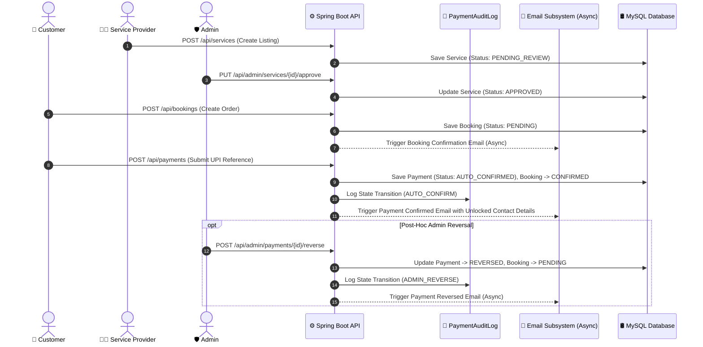

<div align="center">

# 🛠️ ServeNow
### *On-Demand Smart Service Marketplace Platform*

[](https://www.oracle.com/java/)
[](https://spring.io/projects/spring-boot)
[](https://www.mysql.com/)
[](https://flywaydb.org/)
[](https://www.docker.com/)
[](LICENSE)

*An enterprise-grade, multi-city service marketplace connecting consumers with verified local service professionals (Plumbing, Electrical, Cleaning, Tutoring, Web Development).*

---

[Key Features](#-key-features) • [System Architecture](#-system-architecture) • [Key Decisions](#-key-engineering-decisions) • [API Specs](#-api-specification) • [Getting Started](#-getting-started) • [Docker Setup](#-docker-environment)

</div>

---

## 📖 Executive Summary

Modern service platforms require a balance between **low user friction**, **strict privacy controls**, **auto-approved reference payments**, **immutable audit trails**, and **reliable database performance**. 

**ServeNow** is engineered to address these core challenges:
- **City-Based Service Discovery**: Multi-city filtering allowing users to discover active, approved services in their specific city with composite database indexing.
- **Frictionless Auto-Approve UPI Payment Engine**: Instant payment auto-confirmation (`AUTO_CONFIRMED`) on UPI reference submission for zero-friction demoing, with an abstraction layer (`PaymentGatewayPort`) for plug-and-play PSP integration.
- **Immutable Admin Audit Trail & Post-Hoc Reversal**: Complete state transition logging (`payment_audit_logs`) and post-hoc admin payment reversal capabilities (`POST /api/admin/payments/{id}/reverse`) that safely revert bookings and notify customers.
- **Asynchronous Gmail Notification Subsystem**: Background thread pool executing rich HTML email alerts via `JavaMailSender` without blocking HTTP requests.
- **Hardened Database Layer & HikariCP Tuning**: Explicit connection pool sizing (`maximum-pool-size: 10`, `minimum-idle: 5`), socket timeouts, `@EntityGraph` N+1 query elimination, and Spring Actuator health monitoring (`/actuator/health`).

---

## ✨ Key Features

### 📍 City Discovery & Amazon-Inspired Frontend
- **High-Contrast Design System**: Dark Navy (`#131921`) header, Amber action triggers (`#febd69`), and price badges (`#f08804`).
- **City Selector Header**: Public city selection dropdown dynamically updating search scope.
- **Interactive Multi-Category Filtering**: Instant filter across Plumbing, Electrical, Cleaning, Tutoring, Design, Web Dev, Carpentry, and Pest Control.
- **Customer Booking Tracker & Stepper**: Visual progress tracker (`Booked` → `Payment Verified` → `Fulfilled`) with paginated status filtering (`#bookings?status=CONFIRMED`).

### 💳 Auto-Approve UPI Payment & Audit Engine
- **Frictionless Auto-Confirmation**: UPI reference submission instantly auto-confirms payment (`AUTO_CONFIRMED`) and updates booking status to `CONFIRMED`.
- **PaymentGatewayPort Interface**: Clean architectural abstraction for future PSP gateway integration.
- **Post-Hoc Admin Reversal**: Admins inspect payments post-hoc and reverse suspicious entries with custom audit notes, reverting bookings back to `PENDING`.
- **Contact Info Unlock**: Sensitive provider contact details unlock automatically upon payment confirmation.

### 📩 Asynchronous Gmail Notification System
- **Non-Blocking Execution**: `@EnableAsync` with custom thread pool executor (`AsyncConfig.java`).
- **Transactional HTML Templates**: Automatic background emails for booking creation, payment submission, auto-confirmation, and post-hoc reversal.

### 🛡️ Admin Dashboard & Security
- **Role-Based Access Control**: `/api/admin/**` endpoints secured with Spring Security (`ROLE_ADMIN`).
- **Service Approvals**: Approve or reject provider-submitted listings.
- **Audit Logging**: Immutable tracking of all payment status transitions with timestamp, actor, and reason.
- **City Management**: Add operating cities and toggle city visibility.

---

## 🏗️ System Architecture

### 📂 Directory Structure

```text
smart-service-marketplace/
├── 📁 src/main/java/com/example/marketplace/
│   ├── 📁 config/          # Security, CORS, Async Thread Pool, Flyway, & OpenAPI Configs
│   ├── 📁 controller/      # REST Endpoints (Auth, Service, Booking, Payment, Admin, City, Health)
│   ├── 📁 dto/             # Data Transfer Objects (Request/Response Models)
│   ├── 📁 entity/          # JPA Domain Entities (User, ServiceListing, Booking, Payment, PaymentAuditLog, City)
│   ├── 📁 exception/       # Centralized RFC 7807 Global Exception Handling
│   ├── 📁 port/            # PaymentGatewayPort Abstraction Interface & Stub Implementation
│   ├── 📁 repository/      # Spring Data JPA Repositories (Optimized with @EntityGraph)
│   ├── 📁 security/        # Stateless Security & JWT Authentication Filters
│   └── 📁 service/         # Encapsulated Business Services (Payment, Email, Admin, City)
├── 📁 src/main/resources/
│   ├── 📁 db/migration/    # Flyway Versioned SQL Migration Scripts (V1 to V8)
│   ├── 📁 static/          # Single-Page Web App (index.html)
│   └── application.yml     # Hardened Application Configuration (HikariCP, MySQL, Mailer, Actuator)
├── docker-compose.yml      # Multi-container Docker Stack (MySQL 8.0 + MailHog + App)
├── Dockerfile              # Production Container Build Specification
└── pom.xml                 # Maven Build Dependencies
```

---

## 🔄 End-to-End Payment & Approval Workflow



---

## ⚡ Key Engineering Decisions

> [!NOTE]
> **1. Frictionless Auto-Approval with Post-Hoc Reversal Safety**
> For demo environments, manual admin approvals introduce unnecessary friction. ServeNow auto-confirms payment references immediately upon submission (`AUTO_CONFIRMED`), unlocking provider contact details instantly. Safety is preserved via immutable `PaymentAuditLog` entries and post-hoc admin reversal (`POST /api/admin/payments/{id}/reverse`).

> [!IMPORTANT]
> **2. Database Hardening & Indexing Strategy (Flyway V8)**
> FK columns (`service_id`, `category_id`, `provider_id`, `city_id`) and high-traffic query targets are explicitly indexed viaFlyway migration `V8`. High-volume service discovery queries utilize a composite index on `service_listings(city_id, active, status)`.

> [!TIP]
> **3. N+1 Query Elimination via `@EntityGraph`**
> Primary repository query paths in `BookingRepository` and `PaymentRepository` use `@EntityGraph` to eagerly join related entities (`customer`, `service`, `provider`, `city`, `confirmedByAdmin`, `reversedByAdmin`) in a single SQL query, reducing query count overhead.

---

## 🧰 Tech Stack Matrix

| Layer | Technology | Details |
|---|---|---|
| **Language** | Java 17 / JDK 25 | Standard JDK Features, Modern Syntax |
| **Backend Framework** | Spring Boot 3.2.5 | Spring MVC, Spring Security, Spring Data JPA, Spring Async, Actuator |
| **Database & Sizing** | MySQL 8.0 + HikariCP | Explicit Pool Tuning (`max-pool: 10`, `min-idle: 5`, `leak-threshold: 30s`) |
| **Schema Migration** | Flyway 10.x | Version-Controlled SQL Scripts (V1 through V8) |
| **Email Engine** | JavaMailSender + Async | HTML Templates, Non-blocking Thread Pool |
| **Frontend** | Vanilla HTML5 / CSS3 / ES6+ | Zero-Dependency Single Page Application with City Selector & Hash Router |
| **Containerization** | Docker & Docker Compose | Multi-container Orchestration |

---

## 📡 API Specification

### 📊 Health & Diagnostics
| Method | Endpoint | Description | Auth Required |
|---|---|---|---|
| `GET` | `/api/health` | Database connection status & live record metrics | Public |
| `GET` | `/actuator/health` | Spring Boot Actuator DB health status | Public |

### 📍 Cities & Service Discovery
| Method | Endpoint | Description | Auth Required |
|---|---|---|---|
| `GET` | `/api/cities` | List active platform cities | Public |
| `GET` | `/api/services` | Search approved services (`?cityId=1&keyword=...`) | Public |
| `GET` | `/api/services/{id}` | Get service details (Provider contact masked) | Public |
| `POST` | `/api/services` | Register service listing (Starts in `PENDING_REVIEW`) | Public |

### 💳 Payments & Bookings
| Method | Endpoint | Description | Auth Required |
|---|---|---|---|
| `POST` | `/api/bookings` | Create new service booking | Public |
| `POST` | `/api/payments` | Submit manual UPI reference ID (Auto-confirms immediately) | Public |
| `GET` | `/api/bookings/me` | Customer booking history tracker (`?status=CONFIRMED&page=0`) | Public |
| `GET` | `/api/bookings/customer` | Customer booking history (`?email=...`) | Public |
| `GET` | `/api/bookings/provider` | Provider job assignments (`?email=...`) | Public |

### 🛡️ Admin Management Console
| Method | Endpoint | Description | Auth Required |
|---|---|---|---|
| `GET` | `/api/admin/services` | List pending services for review (`?status=PENDING_REVIEW`) | `ROLE_ADMIN` |
| `PUT` | `/api/admin/services/{id}/approve` | Approve service listing | `ROLE_ADMIN` |
| `PUT` | `/api/admin/services/{id}/reject` | Reject service listing | `ROLE_ADMIN` |
| `GET` | `/api/admin/payments` | List all payment audit logs & references (`?status=AUTO_CONFIRMED`) | `ROLE_ADMIN` |
| `POST` | `/api/admin/payments/{id}/confirm` | Manually confirm payment reference | `ROLE_ADMIN` |
| `POST` | `/api/admin/payments/{id}/reverse` | Reverse auto-confirmed payment post-hoc with reason note | `ROLE_ADMIN` |
| `POST` | `/api/admin/cities` | Add new operating city | `ROLE_ADMIN` |
| `PUT` | `/api/admin/cities/{id}/toggle` | Toggle active status of a city | `ROLE_ADMIN` |

---

## 🚀 Getting Started

### Prerequisites
- **Java 17+** (or JDK 25)
- **MySQL 8.0** running on `localhost:3306`
- **Maven 3.8+**

### 1️⃣ Database Setup
Create MySQL database:
```sql
CREATE DATABASE IF NOT EXISTS marketplace_db;
```

### 2️⃣ Configure Environment
Set mail credentials in `src/main/resources/application.yml` or environment variables:
```yaml
spring:
  mail:
    host: smtp.gmail.com
    port: 587
    username: ${MAIL_USERNAME:vishalghasoliya22@gmail.com}
    password: ${MAIL_APP_PASSWORD:your_app_password}
```

### 3️⃣ Build & Run Tests
```bash
mvn clean test
```

### 4️⃣ Launch Application
```bash
java -jar target/smart-service-marketplace-1.0.0-SNAPSHOT.jar --server.port=8081
```

Access portal at: **`http://localhost:8081`**

---

## 🐳 Docker Environment

Launch complete multi-container stack (MySQL 8.0 + MailHog SMTP + Application):

```bash
docker compose up -d
```

- **Web Application**: `http://localhost:8081`
- **MailHog Web UI**: `http://localhost:8025`
- **Database Port**: `3306`

---

## 📄 License & Contact

Distributed under the MIT License. Developed for the **Smart Service Marketplace Major Project**.
