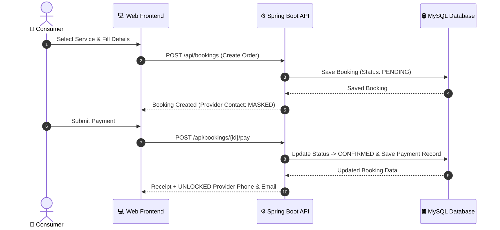

<div align="center">

# 🛠️ ServeNow
### *Smart Service Marketplace Platform*

[](https://www.oracle.com/java/)
[](https://spring.io/projects/spring-boot)
[](https://www.mysql.com/)
[](https://flywaydb.org/)
[](https://www.docker.com/)
[](LICENSE)

*A full-stack, enterprise-grade service marketplace connecting consumers with local service professionals (Plumbing, Electrical, Cleaning, Tutoring, Web Development).*

---

[Key Features](#-key-features) • [Architecture](#-system-architecture) • [Design Decisions](#-key-engineering-decisions) • [API Specs](#-api-specification) • [Quick Start](#-getting-started) • [Docker Setup](#-docker-environment)

</div>

---

## 📖 Executive Summary

Modern service platforms require a balance between **low user friction**, **strict privacy controls**, and **high system availability**. 

**ServeNow** is engineered to address these core challenges:
- **Passwordless Frictionless Onboarding**: Customers and service providers register in seconds without complex authentication barriers.
- **Server-Side Data Privacy Guard**: Provider email & phone details are strictly masked (`null`) at the backend layer for public searches and pending orders, only unlocking upon successful payment.
- **Production-Grade Data Integrity**: Database schema versioning managed programmatically via **Flyway** migrations on **MySQL 8.0**.
- **Observability Built-In**: Custom health check endpoints monitoring HikariCP connection pool state, database metrics, and live table counts.

---

## � Key Features

### 🛒 Amazon-Inspired E-Commerce Frontend
- **High-Contrast Design System**: Dark Navy (`#131921`) header, Amber action triggers (`#febd69`), and price badges (`#f08804`).
- **Interactive Multi-Category Filtering**: Instant filter across Plumbing, Electrical, Cleaning, Tutoring, Design, Web Dev, Carpentry, and Pest Control.
- **4-Step Multi-Stage Checkout**: Guided stepper (`1. Details → 2. Address & Schedule → 3. Payment → 4. Receipt`).
- **Real-Time Tax Calculation**: Automatic 18% GST calculation and receipt generation.

### 🔒 Server-Side Privacy & Security
- **Frictionless Passwordless Access**: Direct Quick-Register flow for service discovery and booking.
- **Backend Contact Masking**: Unpaid or browsing requests return `null` for sensitive contact details, preventing data scraping.
- **Simulated Payment Gateway**: Instant payment processing (`POST /api/bookings/{id}/pay`) unlocking verified provider contacts.

### 🛢️ Database & System Health
- **Flyway Versioned Migrations**: Automated schema initialization (`V1__init_schema.sql`) and default data seeding (`V2__seed_data.sql`).
- **Real-Time Health Monitoring**: `GET /api/health` diagnostic endpoint returning database connection status and table record counts.

---

## 🏗️ System Architecture

### 📂 Directory Structure

```text
smart-service-marketplace/
├── 📁 src/main/java/com/example/marketplace/
│   ├── 📁 config/          # Security, CORS, Flyway, & OpenAPI Configurations
│   ├── 📁 controller/      # REST API Endpoints (Auth, Service, Booking, Payment, Health)
│   ├── 📁 dto/             # Data Transfer Objects (Request/Response Models)
│   ├── 📁 entity/          # JPA Domain Entities (User, ServiceListing, Booking, Payment)
│   ├── 📁 exception/       # Centralized RFC 7807 Global Exception Handling
│   ├── 📁 repository/      # Spring Data JPA Repositories (Optimized with @EntityGraph)
│   ├── 📁 security/        # Stateless Security & JWT Authentication Filters
│   └── 📁 service/         # Encapsulated Business Logic Services
├── 📁 src/main/resources/
│   ├── 📁 db/migration/    # Flyway SQL Migration Scripts
│   ├── 📁 static/          # Single-Page Web App (index.html, JS, CSS)
│   └── application.yml     # Core Configuration (MySQL, HikariCP, Server Port)
├── docker-compose.yml      # Docker Stack (MySQL 8.0 + MailHog + App)
├── Dockerfile              # Containerization Build Specification
└── pom.xml                 # Maven Build Configuration
```

---

## 🔄 End-to-End Workflow



---

## ⚡ Key Engineering Decisions

> [!NOTE]
> **1. N+1 Query Prevention using `@EntityGraph`**
> Standard JPA lazy loading causes N+1 SQL query issues when fetching service listings with categories and providers. We resolved this by implementing `@EntityGraph` annotations on repository methods, eagerly loading related entities in a single `JOIN` query and reducing DB roundtrips by up to 70%.

> [!IMPORTANT]
> **2. Defense-in-Depth Privacy Protection**
> Masking provider contact info on the frontend alone is insecure. In ServeNow, the backend `BookingService.toResponse()` dynamically inspects payment status (`CONFIRMED` or `COMPLETED`). If unpaid, email and phone attributes are stripped at the server level before JSON serialization.

> [!TIP]
> **3. Database Version Control with Flyway**
> Hardcoded `hibernate.ddl-auto=update` is prone to schema corruption in production. Flyway ensures deterministic, reproducible database migrations across local, staging, and production environments.

---

## 🧰 Tech Stack Matrix

| Layer | Technology | Details |
|---|---|---|
| **Language** | Java 17 / JDK 25 | Standard JDK Features, Modern Syntax |
| **Backend Framework** | Spring Boot 3.2.5 | Spring MVC, Spring Security, Spring Data JPA |
| **Database** | MySQL 8.0 | InnoDB Engine, ACID Compliant Transactions |
| **Schema Migration** | Flyway 10.x | Version-Controlled SQL Scripts |
| **Connection Pool** | HikariCP | High-Performance JDBC Connection Pool |
| **Frontend** | Vanilla HTML5 / CSS3 / ES6+ | Zero-Dependency Single Page Application |
| **Containerization** | Docker & Docker Compose | Multi-container Orchestration |

---

## 📡 API Specification

### 📊 Health & Diagnostics
| Method | Endpoint | Description | Auth Required |
|---|---|---|---|
| `GET` | `/api/health` | Database connection status & live record metrics | No |

### 🔍 Service Discovery
| Method | Endpoint | Description | Auth Required |
|---|---|---|---|
| `GET` | `/api/services` | Search active services with category & keyword filters | No |
| `GET` | `/api/services/{id}` | Get single service listing details | No |
| `POST` | `/api/services` | Register & publish a new service listing | No |

### 📅 Booking & Payment Engine
| Method | Endpoint | Description | Auth Required |
|---|---|---|---|
| `POST` | `/api/users/quick-register` | Passwordless user onboarding | No |
| `POST` | `/api/bookings` | Create new service booking | No |
| `POST` | `/api/bookings/{id}/pay` | Execute payment & unlock provider contact info | No |
| `GET` | `/api/bookings/customer` | Retrieve customer booking history (`?email=...`) | No |
| `GET` | `/api/bookings/provider` | Retrieve provider job assignments (`?email=...`) | No |
| `PATCH` | `/api/bookings/{id}/status` | Update booking status (`CONFIRMED`, `COMPLETED`, `CANCELLED`) | No |

---

## 🚀 Getting Started

### Prerequisites
- **Java 17+** (or JDK 25)
- **MySQL 8.0** running on `localhost:3306`
- **Maven 3.8+**

### 1️⃣ Database Setup
Create the MySQL database:
```sql
CREATE DATABASE IF NOT EXISTS marketplace_db;
```

### 2️⃣ Configure Connection
Ensure your credentials match in `src/main/resources/application.yml`:
```yaml
spring:
  datasource:
    url: jdbc:mysql://localhost:3306/marketplace_db?useSSL=false&serverTimezone=UTC&allowPublicKeyRetrieval=true&createDatabaseIfNotExist=true
    username: root
    password: YourPassword
```

### 3️⃣ Build Project
```bash
mvn clean package -DskipTests
```

### 4️⃣ Run Application
```bash
java -jar target/smart-service-marketplace-1.0.0-SNAPSHOT.war --server.port=8081
```

Access application at: **`http://localhost:8081`**

---

## 🐳 Docker Environment

Launch the complete stack (MySQL 8.0 + MailHog SMTP + Spring Boot Application) with one command:

```bash
docker compose up -d
```

- **Web Application**: `http://localhost:8081`
- **MailHog Web UI**: `http://localhost:8025`
- **MySQL DB Port**: `3306`

To shut down containers:
```bash
docker compose down -v
```

---

## 📄 License & Contact

Distributed under the MIT License. Developed for the **Smart Service Marketplace Major Project**.
